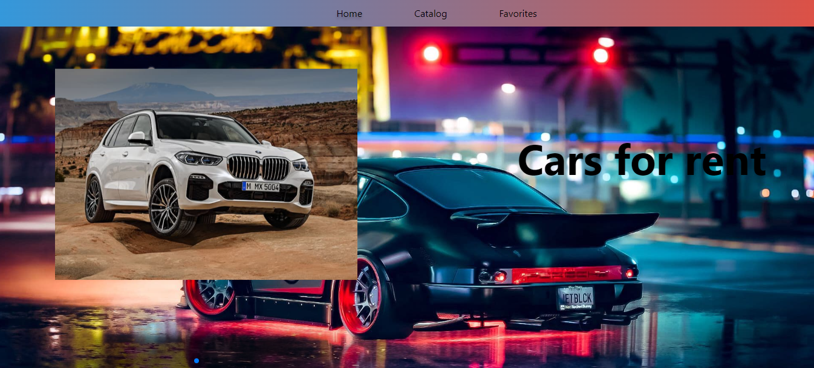
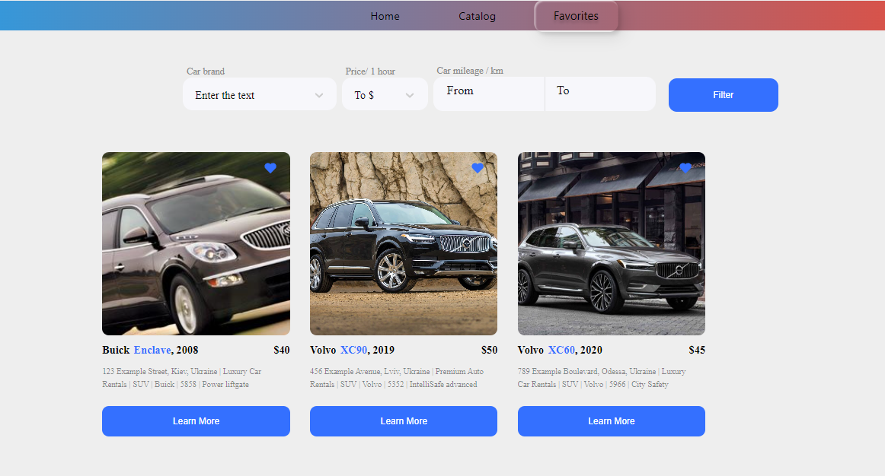

#Cars-for-rent

Car-for-rent- це інноваційний і зручний інструмент, який дозволяє користувачам знаходити, бронювати і орендувати автомобілі в зручний для них спосіб. Основною метою такого додатка є спрощення і автоматизація процесів пошуку та бронювання транспортних засобів.

#Catalog

Ласкаво просимо до нашого розмаїтого каталогу автомобілів! Тут ви знайдете широкий вибір високоякісних транспортних засобів, які задовольнять різноманітні потреби та бюджети. Від стильних седанів до просторих кросоверів та вантажівок - у нас є автомобіль для кожного.

#Favorites

В секції "Улюблені" ми пропонуємо вам зручний спосіб відслідковувати та зберігати автомобілі, які особливо сподобалися вам під час перегляду нашого каталогу. Зберігайте свої улюблені моделі, порівнюйте їх технічні характеристики та приймайте остаточне рішення щодо оренди.

#Modal

Модальне вікно "Деталі та Контакти" - це зручний інструмент для отримання всієї необхідної інформації про конкретний автомобіль та можливість негайно зв'язатися з власником чи представником орендної компанії. Вам буде доступна повна технічна інформація, а також контактні дані для детального обговорення умов оренди.

#Початок Роботи
Щоб розпочати роботу з нашим "Cars-for-rent", дотримуйтеся наступних кроків:

Клонуйте цей репозиторій на свій локальний комп'ютер.
Встановіть необхідні залежності, запустивши npm install або yarn install.
Запустіть додаток командою npm start або yarn start.
Доступ до додатку в вашому веб-браузері за адресою http://localhost:3000.

#Backend

Для бекенда ми можемо використовувати UI-сервіс https://mockapi.io/. Створити оголошення в Mockapi з наступними полями: id, year, mark, model, type, img, description, споживання палива, розмір двигуна, аксесуари, функціональні можливості, ціна оренди, орендна компанія, адреса, умови оренди, пробіг.

#Контакти
Якщо у вас є питання, пропозиції або вам потрібна допомога, не соромтеся звертатися до нашої служби підтримки за адресою Liussi@ukr.net
